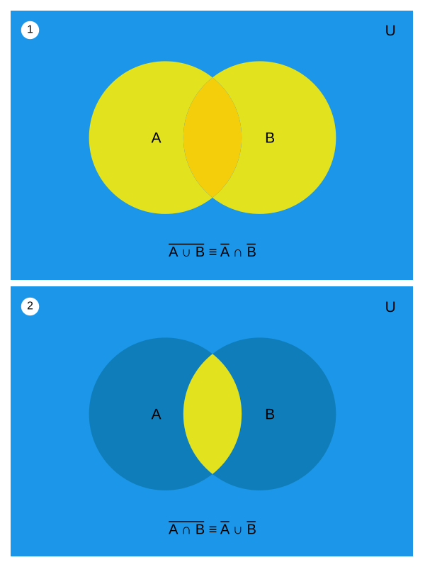

.. probability lecture

Probability Concepts
======================

Probability is a discipline of mathematics that studies analytical formulations 
of uncertainty that can be used characterize random phenomenon.

.. note::

   **PAIRED EXERCISE**

   Team up with the person next to you and come up with examples of two
   kinds of random phenomenon -- one that seems like it could be predicted 
   and one that seems like it would be difficult to predict.

Experiments
-----------

A **sample space** :math:`S` is a collection, specified as a mathematical set

.. math::
   \{x_1, x_2, \cdots, x_p\} 

of all possible **outcomes** 

.. math::
   x_j, \; j= 1, 2 \cdots, p

that might be realized by some **experiment** measuring a random phenomenon.  

An **event** :math:`E` is a meaningful subset of potential outcomes
of the experiment :math:`E \subseteq S` that is said to *have occured* for a realized outcome of the experiment :math:`x^*` 
if :math:`x^*` is a member of set :math:`E`, i.e.,

.. math::
   x^* \in E

**Experiments**

   * flip ten coins, roll two dice, draw a card from a deck
   * take a cookie from a cook jar, evalute an instructor, attend a meetup 
   * measure heights, weights, volumes, temperatures, or distances
   * count the number of cups of coffee consumed before before 10 am
   * count the number of beers consumed right after this stats workshop

**Outcomes**

   * ten sequential coin flips, two die rolls, a card from a deck
   * a cookie, an instructor evaluation, teachers, the name of an attended meetup 
   * a height, a weight, a volume, a temperature, or a distance
   * a number
   * hopfully not too many

**Events**

   * "Half heads", "Odds", "Spades"
   * "With Chips", "Boring", "Data Science related meetup"
   * "Tall people" (>6 ft), "Small people" (<100 lbs), "Not full milk" (<1 G), "Frozen water (<32 F)", "close" (<2 mi)
   * "<2 cups of coffee before before 10 am"
   * "NA"

.. note:: 

   **TEAM EXERCISE**
   
   Work with your neighbors to list out possible sample spaces for the
   above examples.
  
Set Operations
--------------

For events :math:`A` and :math:`B`
defined on the sample space :math:`S` of an experiment

* Union: :math:`A \cup B = \{x: x \in A \text{ or } x\in B\}`

  is the event where  **either** event :math:`A` or event :math:`B` or both occur

..

* Intersection: :math:`A \cap B = \{x: x \in A \text{ and } x\in B\}`

  is the event where **both** the event :math:`A` and the event :math:`B` occur

..

* Difference: :math:`A \setminus B = \{x: x \in A \text{ and } x \notin B\}`

  is the event where **only** the event :math:`A` occurs **but not** the event :math:`B`

..

* Complement: :math:`\overline A = A^C = \{x: x\notin A\}`

  is the event that event :math:`A` **does not** occur

..

* The Null (Empty) Set: :math:`\emptyset`

  is the event that contains no outcomes, which can't happen 
  if the experiment is run

.. note:: 

   **TEAM EXERCISE**
   
   Come up with couple of example sets and have each member of the
   team give explain the following concepts using your example:
   *Union*, *Intersection*, *Difference*, or *Complement*.

DeMorgan's Laws 
---------------
(The next best thing to Bayes' rule and rum)

`De Morgan's laws <https://en.wikipedia.org/wiki/De_Morgan's_laws>`_ are tautologies that say for events :math:`A` and :math:`B`:

1. The complement of the union of two sets is the same as 
the intersection of their complements:

.. math::

  \neg (A \vee B) \iff \neg A \wedge \neg B

2. The complement of the intersection of two sets is the same as 
the union of their complements:

.. math::

  \neg (A \wedge B) \iff \neg A \vee \neg B
   
where the expressions utilize the standard logic notation 
of :math:`\vee` and :math:`\wedge` for the
`or` and `and` operators, respectively, 
and :math:`\neg` for the negation operator ("not").

The truthfulness of DeMorgan's laws can be examined using a 
**Venn diagram**:

     
.. note::

   **EXERCISE**

   Copy the following 3 lines into a python interpreter, ipython session or script 
		
   >>> a = set(["A","B","C","D"])
   >>> b = set(["C","D","E","F"])
   >>> sample_space = set(["A","B","C","D","E","F","G"])

   and try out these set operations
   
   >>> a.intersection(b)
   set(['C', 'D'])
   >>> a.difference(b)
   set(['A', 'B'])
   >>> a.union(b))
   set(['A', 'B', 'C', 'D', 'E', 'F'])
   >>> complement_a = sample_space.difference(a)
   
   Can you give an example of De Morgan's laws in Python?

Random Variables
----------------
   
A random variable :math:`X` is a function that maps outcomes :math:`s` from its sample space :math:`S` onto the real numbers :math:`x \in \mathbb{R}`, i.e.,

.. math::
        X(s) : S\rightarrow \in \mathbb{R}

where standard notation utilizes capital letters for random variables, 
and lowercase letters for actualized observations (realizations) of 
random variables. 

The realizations :math:`x` of a random random variable :math:`X` are
dictated by the probabilities assigned to the outcomes comprising the 
sample space :math:`S`. I.e., for some event :math:`E \subseteq \mathbb{R}` 
defined with respect to the random variable :math:`X` 

.. math::
        Pr(X=x \in E) = Pr(\{s\in S : X(s) \in E\})

.. note::

   **QUESTION**

   Does a random variable have a "value" like a variable in python, or an
   algebraic expression?
     
`Random variables (Khan academy) <https://www.khanacademy.org/math/statistics-probability/random-variables-stats-library/discrete-and-continuous-random-variables/v/random-variables>`_

Putting It All Together
^^^^^^^^^^^^^^^^^^^^^^^

Let's challenge our understanding by using the 
concepts we've learned along with a new idea 
called **mutual exclusivity**: 
two events :math:`A` and :math:`B` are said to be *mutually exclusive* if 

.. math::
   Pr (X=x \in A \cup B) = Pr(X=x \in A) + Pr(X=x \in B)

.. note::

   **EXERCISE**

   Let :math:`X` be a random variable which measures cholesterol 
   and :math:`x` an actual cholesterol measurement and define
   the following three events  

   .. math::
      A = \{chol: 250 \leq chol \leq 300\}

   .. math::
      B = \{chol: chol > 300\}

   .. math::
      C = \{chol: chol \leq 280\}

   where :math:`A` and :math:`B` are *mutually exclusive*, but :math:`A` and :math:`C` are not.

   1. Discuss what it means to be mutually exclusive.

   2. What is the union of sets :math:`A` and :math:`C`?
      And how about :math:`(A \cup B)` = ?
 
   3. If :math:`Pr(X=x\in A) = 0.2` and :math:`Pr(X=x\in B) = 0.1`, 
      then :math:`Pr(X=x \geq 250)` = ?

   4. [Extra] If :math:`P(X=x\in A) = .3` and :math:`P(X=x\in C)=.2`,
      then what would you need to know to calculate :math:`P(X=x \leq
      300)`?

      
Further study
-------------

If you want to learn more about working with sets in Python, see:

`<https://www.programiz.com/python-programming/set>`_

If you want more about sets and set operations in general then check out the Khan academy video series on sets, see:

`<https://www.khanacademy.org/math/statistics-probability/probability-library/basic-set-ops/v/intersection-and-union-of-sets>`_
	       
