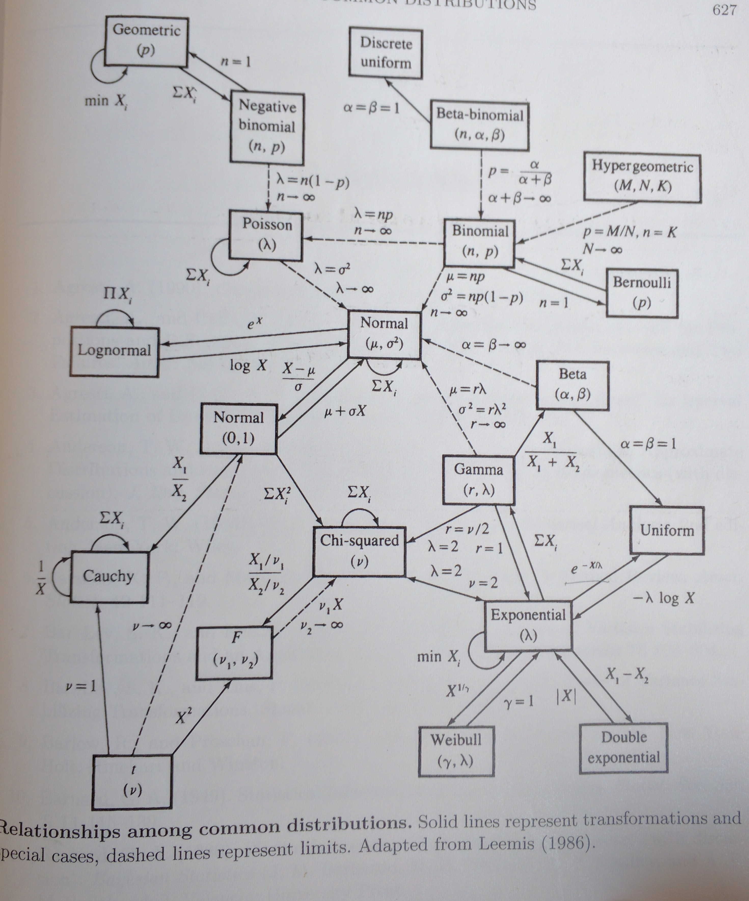

.. probability lecture

Probability distributions
=============================

A probability distribution is a mathematical formalization that describes a particular type of random process. Though a random variable is more general than a probability distribution in that there may not be a known distribution behind a particular variable, often when we think of a random variable we imagine it is being generated by one of these common probability distributions. 

`The SciPy docs for statistics <https://docs.scipy.org/doc/scipy/reference/tutorial/stats.html>`_ is quite useful.

Properties of distributions
-----------------------------

These are common properties used to characterize a distribution:

   * Expectation/mean
   * Variance/standard deviation
   * Skewness (asymmetry)
   * Kurtosis (fat tails)

Rules for choosing a good distribution
-----------------------------------------

Main questions
^^^^^^^^^^^^^^^^

   * Are my data discrete or continuous?
   * Are my data symmetric?
   * What limits are there on possible values for my data?

Other questions to keep in mind
^^^^^^^^^^^^^^^^^^^^^^^^^^^^^^^^^^^^     
     
   * How likely are extreme values?
   * Are there missing values?

Essential distributions
--------------------------
     
Bernoulli:
^^^^^^^^^^^

A Bernoulli distribution is a discrete probability distribution for a
Bernoulli trial.  The distribution takes the value 1 with success
probability of :math:`p` and the value 0 with failure.  Success could
be heads on a coin flip.

PMF = :math:`P[success] = p` , :math:`P[failure] = 1-p`

Mean: :math:`E[x] = p`

Variance: :math:`Var(x) = p(1-p)`

.. plot:: bernoulli-distn.py

.. note:: Lets say that I polled all first graders in the state of
   colorado and asked the question do you like/dislike your teacher.
   The answers are discrete values and the distribution of those
   answers could be modelled with a Bernoulli.

   Can you think of another example?

See this `khan academy video on the Bernoulli to get a better intuition <https://www.khanacademy.org/math/statistics-probability/sampling-distributions-library/sample-proportions/v/mean-and-variance-of-bernoulli-distribution-example>`_	  

Binomial:
^^^^^^^^^^^

The Binomial distribution gives the discrete probability distribution
of obtaining exactly `k` successes out of `n` trials

PMF: :math:`P[X=k] = {n \choose k}p^k(1-p)^{n-k}, \forall k \in \{0, 1,..., n\}`

Mean: :math:`np`

Var: :math:`np(1-p)`

.. plot:: binomial-distn.py

.. note::

   The number of heads that come from flipping a coin 10 times can be modeled with a binomial

   Can you think of another example that might be modeled by a binomial?

   See this `khan academy video on the binomial distribution to get a better intuition <https://www.khanacademy.org/math/statistics-probability/random-variables-stats-library/binomial-random-variables/v/binomial-distribution>`_

Poisson
^^^^^^^^^^^

If a mean of an event happening per unit time is observed and you need the probability of `n` events happening

PMF: :math:`P[X=k] = \frac{\lambda^k e^{-\lambda}}{k!},\forall k \in \{0,1,2,...\}`

Mean: :math:`\lambda`

Variance: :math:`\lambda`

.. plot:: poisson-distn.py

.. note::

   The probability that one,two,..., :math:`n` uber cars pass in front of my building in an hour

   Can you think of another example?
   
See this `How does the binomial relate to the poisson (khan academy) video <https://www.youtube.com/watch?v=3z-M6sbGIZ0>`_

Then check out the `example on the poisson distribution (khan academy) video <https://www.youtube.com/watch?v=Jkr4FSrNEVY>`_

Some `poisson examples are discussed here <https://www.umass.edu/wsp/resources/poisson>`_ 

Uniform
^^^^^^^^^^^

PDF: :math:`f(x) = \frac{1}{b-a}, \forall x\in[a, b]`,  0 otherwise

MEAN: :math:`\frac{a+b}{2}`

VARIANCE: :math:`\frac{(b-a)^2}{2}`

Normal aka Gaussian
^^^^^^^^^^^^^^^^^^^^^^^

The Gaussian is the most widely used distribution for continuous
variables. The distribution is governed by the mean :math:`\mu` and variance :math:`\sigma^2`.

SUPPORT :math:`x \in (-\inf, \inf)`

PDF: :math:`\frac{1}{\sqrt{2\pi\sigma^2}}exp(-\frac{(x - \mu)^2}{2\sigma^2})`

MEAN: :math:`\mu`

VARIANCE: :math:`\sigma^2`

The inverse of the variance is known as the **precision** (:math:`\tau = 1/\sigma^{2}`).

.. plot:: gaussian-distn.py

.. note::
   test scores, IQs, heights, finishing times from the boston marathons (almost)
	  
`Khan academy intro <https://www.khanacademy.org/math/statistics-probability/modeling-distributions-of-data/normal-distributions-library/v/introduction-to-the-normal-distribution>`_

This is a really important distribution because it appears over and over in nature.  It is extremely useful in statistical inference and it is a key component of `the central limit theorem <https://en.wikipedia.org/wiki/Central_limit_theorem>`_.

Less essential distributions
--------------------------------
	  
Geometric
^^^^^^^^^^^^^

The probability of some number (`X`) of Bernoulli trials needed to get one success.  It also refers to probability of (`X-1`) failures before the first success. 

PMF: :math:`P[X=k] = p (1-p)^{k-1}, \forall k \in \{0, 1,...\}`

Mean: :math:`\frac{1}{p}`

Variance: :`\frac{1-p}{p^2}`

Hypergeometric
^^^^^^^^^^^^^^^^

Hypergeometric distribution is a discrete probability distribution
that describes the probability of `k` successes in `n` draws, without
replacement.

The hypergeometric test uses the hypergeometric distribution to
calculate the statistical significance of having drawn a specific k
successes n total draws

Think of an urn with two types of marbles, red ones and green
ones. Define drawing a green marble as a success and drawing a red
marble as a failure (analogous to the binomial distribution).

Did I draw the **expected** number of green marbles?

The data are not accurately modeled by the binomial distribution,
because the probability of success on each trial is not the same.

.. note:: Think Texas Hold em
	  
Exponential
^^^^^^^^^^^^^^^

A good way to model the time between events for a poisson
process.  It is a particular case of the gamma distribution.
It is governed by a rate parameter :math:`\lambda`.

SUPPORT: :math:`x \in (0, \inf)`.

PDF: :math:`\lambda e^{-\lambda x}`

MEAN: :math:`\frac{1}{\lambda}`

VARIANCE: :math:`\frac{1}{\lambda^2}`

.. plot:: exponential-distn.py

	  
Distributions are related
----------------------------

There are many more distributions than the ones mentioned above.  Here is an illustration from *Casella and Berger* that does a pretty good job making that point.
	  

